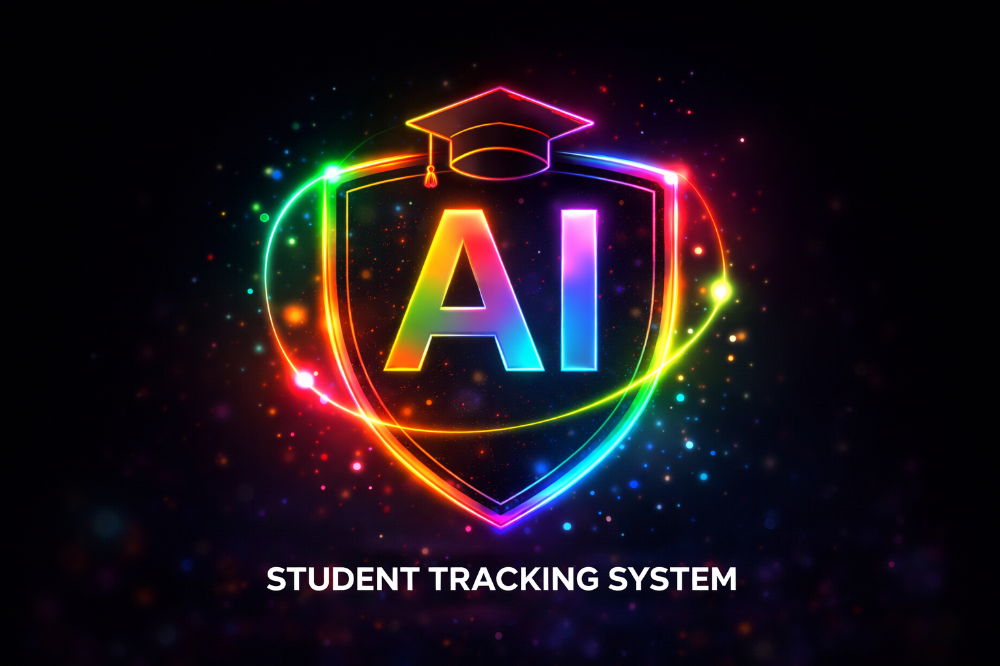

<p align="center">
  
</p>

<h1 align="center">🚀 AI Driven Student Academic Tracking & Recommendation System</h1>

<p align="center">
  An intelligent academic management platform that tracks student performance,
  identifies academically at-risk students, and provides data-driven recommendations.
</p>

<p align="center">
  
  
  
  
</p>

---

## 📌 Overview

The **AI Driven Student Academic Tracking & Recommendation System** is a full-stack web application designed to help educational institutions monitor student academic performance.

The system combines **attendance, examination marks, and academic performance data** to identify students who may be at academic risk.

The application provides separate functionality for **students and faculty**, allowing faculty members to manage academic information while students can monitor their own performance.

---

## 🎯 Problem Statement

Educational institutions often manage attendance and academic performance data across different systems or spreadsheets. This makes it difficult to identify struggling students at an early stage.

This project aims to solve that problem by providing a centralized platform that:

- Tracks student academic performance
- Monitors attendance
- Manages examination marks
- Visualizes performance through dashboards
- Uses machine learning to identify academically at-risk students
- Provides recommendations based on academic performance

---

## ✨ Key Features

### 👨‍🎓 Student Module

- View academic performance
- View attendance records
- View examination marks
- Monitor overall academic progress
- View AI-based risk assessment
- Receive performance recommendations

### 👨‍🏫 Faculty Module

- Manage student academic information
- Manage attendance
- Enter and update examination marks
- Monitor student performance
- Identify academically at-risk students
- Analyze student performance through dashboards

### 🤖 AI / Machine Learning

- Uses student academic data for risk prediction
- Analyzes factors such as attendance and marks
- Identifies students who may require academic attention
- Supports early intervention through performance insights

### 📊 Dashboard

- Academic performance visualization
- Attendance monitoring
- Marks analysis
- Student performance overview
- Risk prediction results

---

## 🧠 System Workflow

```text
             Student Information
                     │
                     ▼
        ┌─────────────────────────┐
        │ Attendance + Marks Data │
        └────────────┬────────────┘
                     │
                     ▼
             Django Backend
                     │
                     ▼
                REST API
                     │
          ┌──────────┴──────────┐
          │                     │
          ▼                     ▼
     React Frontend        ML Model
          │                     │
          │                     ▼
          │              Risk Prediction
          │                     │
          └──────────┬──────────┘
                     ▼
             Student Dashboard
                     │
                     ▼
          Performance Insights
             & Recommendations
